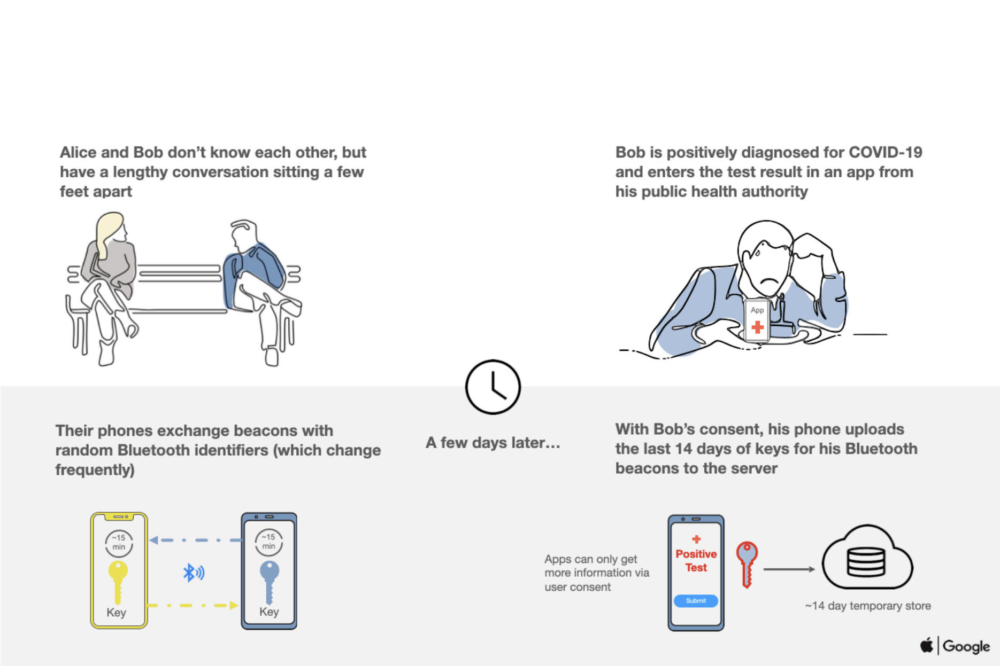
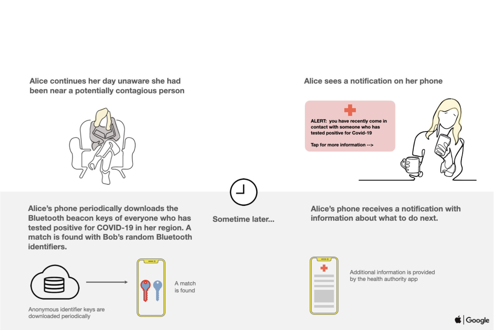
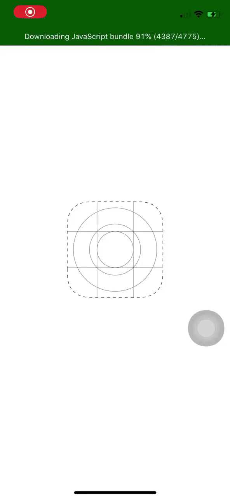
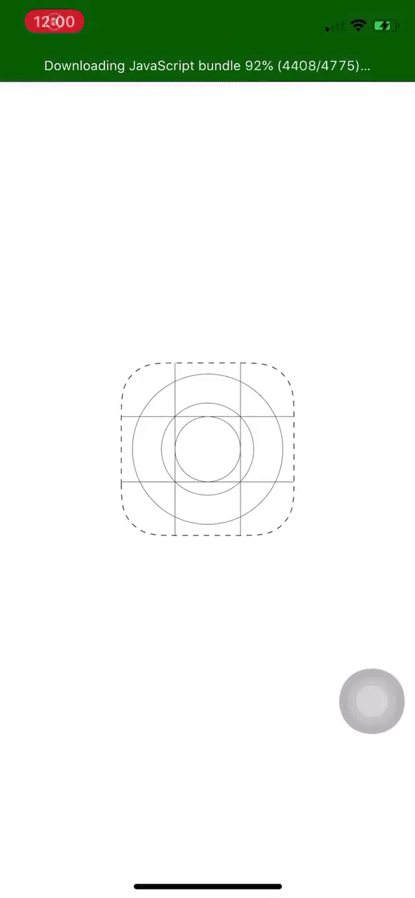

# Trace
Contact tracing app for iOS 13

## Development

- Built with React Native and uses Redux
- Communicates with back-end server at
[filigino/trace-server](https://github.com/filigino/trace-server) via REST API
  - Server stores data via NoSQL MongoDB database
- Uses [tzachari/react-native-contact-tracing](https://github.com/tzachari/react-native-contact-tracing)
for Bluetooth contact tracing
- Splash icon made by Freepik from www.flaticon.com

## Features

- Uses Bluetooth to detect phones of other people the user has come into
contact with
- Supports Push Notifications on confirmed Exposures to others that have
tested positive for COVID-19
- Supports Background App Fetch to check for new Exposures every hour
- Uses a decentralised architecture so no user information is stored at the
server (only unique IDs) and most processing is done locally on the app itself
- Does not implement Apple/Google's Exposures API

## How It Works

Follows Apple and Google's contact tracing scheme:

Using [tzachari/react-native-contact-tracing](https://github.com/tzachari/react-native-contact-tracing)
module, when two phones running Trace detect one another via Bluetooth, each
phone:
- Generates a unique 24 digit string, which it stores locally in a list of
`myIds` and broadcasts the ID to the other phone
- Receives the other phone's ID and stores it locally in a list
of `otherIds`\
Note: The Apple and Google contact tracing scheme specifies that each phone
continually broadcasts its own unique ID until that unique ID is updated every
10-20 minutes. Trace has two IDs generated **each time any two phones come
into contact** - one ID for each phone.

Upon confirmation that a user has tested positive for COVID-19, that user
**should** self-report their infection through the app at which point, the
previous 14 days of the user's `myIds` (IDs it has broadcasted to other phones
the user has come in contact with) will be submitted to the Public Health
Authority.

Periodically, each phone running Trace downloads the list of IDs that
corresponds to users that have tested positive for COVID-19 in the last 14
days. Each phone will then compare its list of `otherIds` (IDs of phones of
others users the user has come into contact with) to the infected list and
notify the user of any matches (i.e. potential exposures).

### Periodic Events
All IDs (`myIds` and `otherIds`) and exposures older than 14 days are deleted:
- Every hour
- Every time Trace is launched

`myIds` older than 14 days are also deleted:
- When a user self-reports

## Demo

Launching and overview
 
 
 

Push notification on exposure
 
 
 

Self-reporting a positive infection

## Assumptions

In order for an app like this to allow for successful contact tracing and to
appropriately warn users about potential exposures, the following must occur:

- All members of the community must download the app to their smartphones
- Users must always keep the app running, at minimum, in the background (or at
least have it running when they are outside of their homes and could
potentially come into contact with others)
- Minimal delay between a positive test result for COVID-19 and self-reporting
that positive result through the app
- Minimal delay between a positive test result for COVID-19 and self-isolation
(should not come into contact with any other users from then on)
- All IDs generated exchanged between phones must truly be unique
